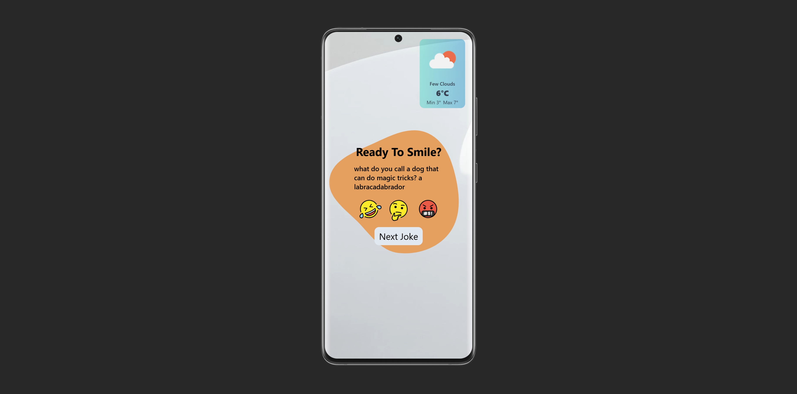

# JokeProject
This project is a web application developed in TypeScript that allows users to get random jokes, rate them, and check the weather. It uses external APIs to obtain jokes and weather data and is structured to facilitate scalability and maintenance.




## Objectives

- **Consuming Multiple APIs:** Implement logic to retrieve jokes from two different APIs and display local weather data using a third API.

- **Strict Implementation in TypeScript:** Ensure the entire application is built in TypeScript, defining clear interfaces and types for all data structures.

- **Asynchronous Handling:** Use Promises or async/await for all API consumption and data retrieval operations.

- **User Tracking and State Management:** Maintain an internal array to track and store user-rated jokes.

- **Advanced UI/UX:** Develop a high-quality, responsive design.


## Estructura de Carpetas

```
jokeProject/
│
├── public/                # Static files (images, icons, blobs)
├── src/                   # Main source code
│   ├── logic/             # Business logic
│   │   ├── controller.ts
│   │   ├── randomDadJoke/         # LLogic and schemes for Dad Jokes
│   │   ├── randomOfficialJoke/    # LLogic and schemes for official jokes
│   │   ├── ratingsJoke/           # Joke rating logic
│   │   └── weather/               # LLogic and schemes for weather
│   ├── services/         # Auxiliary services (API, date, location, storage)
│   └── ui/               # User interface logic
│       ├── randomJoke/   # UI for random jokes
│       ├── ratingJoke/   # UI for joke ratings
│       └── weather/      # UI for weather
├── index.html            # Main HTML file
├── style.css             # Global styles
├── package.json          # Dependencies and scripts
├── tsconfig.json         # TypeScript configuration
├── tailwind.config.js    # Tailwind CSS configuration
└── postcss.config.js     # PostCSS configuration
```


## Technologies Used

- **TypeScript**
- **Vite** (for development and builds)
- **Tailwind CSS** (styles)
- **External APIs** (jokes and weather)

## Installation and Usage

1. **Clone the repository:**
   ```bash
   git clone <https://github.com/juangodoygrando/Sprint_4_typescript-api.git>
   cd jokeProject
   ```

2. **Install the dependencies:**
   ```bash
   npm install
   ```

3. **Start the development server:**
   ```bash
   npm run dev
   ```

4. **Build for production:**
   ```bash
   npm run build
   ```

## Main Dependencies


(See `package.json` for the complete list of dependencies and available scripts)

## Environment Variables

This project uses environment variables.

1. Copy the `.env.example` file.
2. Rename it to `.env`.

## Notes
- The APIs used may require an internet connection.

- You can customize the styles by modifying `style.css` and the Tailwind settings.

---

Enjoy using JokeProject!